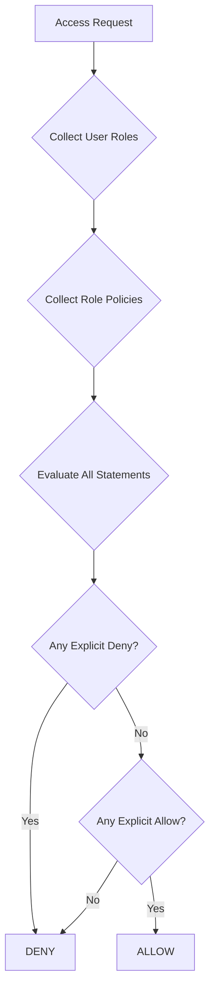

# AWS IAM-Style Policy System

## Overview

This IAM system implements AWS IAM-inspired**policy-based access control** with:
- JSON policy documents
- Statement-based permissions (Effect, Action, Resource, Condition)
- Wildcard support (`*`, `?`)
- **Explicit Deny > Allow** evaluation logic
- Resource scope matrix UI → JSON policy conversion

---

## Core Concepts

### 1. **Policy Document** (AWS IAM-like JSON)

Each policy is defined as a JSON document:

```json
{
  "Version": "2026-01-01",
  "Id": "uuid-here",
  "Name": "ORDERS_PROCESSING",
  "Description": "Full access to order management",
  "Statement": [
    {
      "Sid": "AllowOrdersReadWrite",
      "Effect": "Allow",
      "Action": [
        "orders:read",
        "orders:write",
        "orders:delete"
      ],
      "Resource": ["*"],
      "Condition": {
        "IpAddress": {
          "aws:SourceIp": "10.0.0.0/8"
        }
      }
    }
  ],
  "Meta": {
    "generatedAt": "2026-01-01T12:00:00Z",
    "policyKey": "order:Full"
  }
}
```

### 2. **Policy Statement Fields**

| Field | Description | Example |
|-------|-------------|---------|
| `Sid` | Statement ID | `"AllowOrdersRead"` |
| `Effect` | `Allow` or `Deny` | `"Allow"` |
| `Action` | Namespace:Action | `"orders:read"` |
| `NotAction` | Inverse action match | `["*:delete"]` |
| `Resource` | Resource ARN pattern | `"namespace/orders/*"` |
| `NotResource` | Inverse resource match | `["sensitive/*"]` |
| `Condition` | Context-based rules | See below |

### 3. **Action Format**

Actions follow the pattern: `namespace:action`

**Examples:**
- `orders:read` - Read orders
- `orders:*` - All order actions
- `*:delete` - Delete across all namespaces
- `*` - Everything (super admin)

**Wildcards:**
- `*` matches any sequence
- `?` matches a single character

---

## Evaluation Rules (AWS IAM Logic)

```
1. Explicit Deny ALWAYS wins
2. If at least one Allow matches and no Deny → ALLOW
3. If no statement matches → DENY (default)
4. Conditions must be satisfied for a statement to apply
```

### Evaluation Flow



---

## API Endpoints

### 1. **Seal Scope Configuration**

Convert UI matrix to JSON policy document:

```http
POST /api/policies/{id}/seal
Content-Type: application/json

{
  "orders": {
    "READ": true,
    "WRITE": true,
    "DELETE": true
  },
  "inventory": {
    "READ": true,
    "WRITE": false
  }
}
```

**Response:**
```json
{
  "success": true,
  "policyDocument": { ... },
  "message": "Policy sealed successfully",
  "affectedRoles": 3
}
```

### 2. **Evaluate Access**

Check if a user has permission:

```http
POST /api/policies/evaluate
Content-Type: application/json

{
  "userId": "uuid-here",
  "namespace": "orders",
  "action": "delete",
  "resource": "order/12345",
  "context": {
    "ipAddress": "192.168.1.10",
    "mfaAuthenticated": "true"
  }
}
```

**Response:**
```json
{
  "allowed": false,
  "reason": "Explicit Deny in policy: SECURITY_BASELINE (Statement: DenyDeleteFromPublicIP)",
  "matchedStatements": [
    "SECURITY_BASELINE:DenyDeleteFromPublicIP"
  ],
  "appliedPolicies": [
    "ORDERS_PROCESSING",
    "SECURITY_BASELINE"
  ]
}
```

### 3. **Get Policy Document**

```http
GET /api/policies/{id}/document
```

### 4. **Update Policy Document**

```http
PUT /api/policies/{id}/document
Content-Type: application/json

{
  "Version": "2026-01-01",
  "Statement": [ ... ]
}
```

---

## Condition Operators

Conditions allow context-based access control:

| Operator | Description | Example |
|----------|-------------|---------|
| `StringEquals` | Exact string match | `"aws:username": "admin"` |
| `StringLike` | Wildcard match | `"aws:username": "dev-*"` |
| `IpAddress` | IP address match | `"aws:SourceIp": "10.0.0.0/8"` |
| `Bool` | Boolean check | `"aws:SecureTransport": "true"` |

**Example:**
```json
{
  "Condition": {
    "IpAddress": {
      "aws:SourceIp": "10.0.0.0/8"
    },
    "Bool": {
      "aws:MultiFactorAuthPresent": "true"
    }
  }
}
```

---

## Usage Examples

### Example 1: Full System Access

```json
{
  "Statement": [{
    "Effect": "Allow",
    "Action": ["*"],
    "Resource": ["*"]
  }]
}
```

### Example 2: Read-Only Orders

```json
{
  "Statement": [{
    "Effect": "Allow",
    "Action": ["orders:read"],
    "Resource": ["*"]
  }]
}
```

### Example 3: Deny Delete from Public IPs

```json
{
  "Statement": [{
    "Effect": "Deny",
    "Action": ["*:delete"],
    "Resource": ["*"],
    "Condition": {
      "IpAddress": {
        "aws:SourceIp": "0.0.0.0/0"
      }
    }
  }]
}
```

### Example 4: Matrix-Generated Policy

When you configure this in the UI:

| Namespace | READ | WRITE | DELETE |
|-----------|------|-------|--------|
| orders    | ✓    | ✓     | ✗      |
| inventory | ✓    | ✗     | ✗      |

It generates:
```json
{
  "Statement": [
    {
      "Sid": "Allow_orders",
      "Effect": "Allow",
      "Action": ["orders:read", "orders:write"],
      "Resource": ["*"]
    },
    {
      "Sid": "Allow_inventory",
      "Effect": "Allow",
      "Action": ["inventory:read"],
      "Resource": ["*"]
    }
  ]
}
```

---

## Security Best Practices

1. **Principle of Least Privilege**: Grant only the minimum required permissions
2. **Avoid Global Wildcards**: Prefer `namespace:*` over `*`
3. **Use Explicit Denies**: For critical restrictions that must never be overridden
4. **Require MFA**: For sensitive operations
5. **IP Restrictions**: Limit access to trusted networks
6. **Audit Logging**: Track all policy changes and access evaluations
7. **Version Control**: Keep policy versions for rollback

---

## Frontend Integration

### Seal Button Implementation

```typescript
const sealScopeConfiguration = async (policyId: string, matrix: any) => {
  const response = await api.post(`/policies/${policyId}/seal`, matrix);
  
  if (response.data.affectedRoles > 0) {
    alert(`Policy sealed! ${response.data.affectedRoles} roles affected.`);
  }
  
  // Show generated JSON
  console.log('Generated Policy:', response.data.policyDocument);
};
```

### Access Check (Client-Side)

```typescript
const checkAccess = async (namespace: string, action: string) => {
  const decision = await api.post('/policies/evaluate', {
    userId: currentUser.id,
    namespace,
    action,
    resource: '*'
  });
  
  if (!decision.allowed) {
    alert(`Access Denied: ${decision.reason}`);
  }
  
  return decision.allowed;
};
```

---

## Database Schema

The `permissions` table now includes:

```sql
CREATE TABLE permissions (
    permission_id UUID PRIMARY KEY,
    permission_name VARCHAR(100) UNIQUE NOT NULL,
    permission_key VARCHAR(100) UNIQUE NOT NULL,
    description TEXT,
    policy_document TEXT  -- <-- AWS IAM-style JSON
);
```

---

## Testing

### Test Policy Evaluation

```bash
curl -X POST http://localhost:8080/api/policies/test-evaluate \
  -H "Content-Type: application/json" \
  -d '{
    "userId": "user-uuid",
    "namespace": "orders",
    "action": "delete"
  }'
```

### Test Seal Operation

```bash
curl -X POST http://localhost:8080/api/policies/{id}/seal \
  -H "Content-Type: application/json" \
  -d '{
    "orders": {"READ": true, "WRITE": true},
    "inventory": {"READ": true}
  }'
```

---

## Architecture

```
┌─────────────────┐
│   Frontend UI   │
│  Scope Matrix   │
└────────┬────────┘
         │ Seal
         ▼
┌─────────────────────────┐
│  PolicyController       │
│  POST /policies/{id}/seal│
└───────────┬─────────────┘
            │
            ▼
┌──────────────────────────┐
│ PolicyEvaluationService  │
│ - matrixToPolicyDocument │
│ - evaluateAccess         │
│ - wildcardMatching       │
└───────────┬──────────────┘
            │
            ▼
┌──────────────────────────┐
│   PostgreSQL/H2          │
│   permissions table      │
│   (policy_document JSON) │
└──────────────────────────┘
```

---

## Future Enhancements

- [ ] Policy versioning and rollback
- [ ] Policy simulator/testing tool
- [ ] Advanced condition operators (DateGreaterThan, NumericLessThan)
- [ ] Resource-based policies (in addition to identity-based)
- [ ] Policy inheritance and templates
- [ ] Real-time policy updates via WebSocket

---

## Summary

This IAM system provides enterprise-grade, AWS-compatible access control with:
- ✅ JSON policy documents
- ✅ Deny > Allow evaluation
- ✅ Wildcard support
- ✅ Condition-based access
- ✅ UI matrix → JSON conversion
- ✅ Real-time access evaluation

All changes are effective immediately upon sealing.
